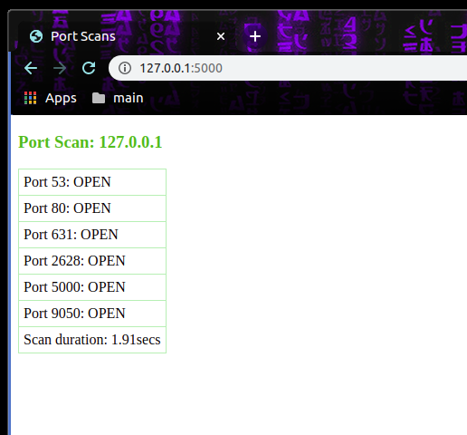

# Flask Portscan

This repo has been made available under [MIT license](https://github.com/nick3499/psutil_cpu_times/blob/master/LICENSE).



## portscan.sh

A shell script can be used to configure exports and start Flask.

```bash
export FLASK_APP=portscan
export FLASK_ENV=development
flask run
```

In a Unix-like terminal emulator, enter the following command line string:

`$ sudo bash portscan.sh`

- `FLASK_APP` environment variable specifies which app to load.
- `FLASK_ENV` environment variable specifies which environment the Flask app operates in. In this case, `development` mode.
- `flask run` starts Flask, which enables _debug mode_, _interactive debugger_ and _reloader_.

Something close to the following will print to terminal:

```
 * Serving Flask app "portscan.py" (lazy loading)
 * Environment: development
 * Debug mode: on
 * Running on http://127.0.0.1:5000/ (Press CTRL+C to quit)
 * Restarting with inotify reloader
 * Debugger is active!
 * Debugger PIN: XXX-XXX-XXX
```

Open `http://127.0.0.1:5000/` in a browser. Since no port was specified, Flask defaults to port `5000`. If some other port number is required, the `FLASK_RUN_PORT` environment variable is available.

## portscan.py

```python
from socket import socket, AF_INET, SOCK_STREAM
from datetime import datetime, timedelta
from flask import Flask, render_template

app = Flask(__name__)

@app.route('/')
def index():
    hostAddress = '127.0.0.1'  # loopback address for scanning localhost
    start_time = datetime.now()  # port scan start time
    data = []  # lists open port strings
    try:
        for port in range(1, 65535):
            sock = socket(AF_INET, SOCK_STREAM)
            sock.settimeout(2)  # scan for 2 secs
            result = sock.connect_ex((hostAddress, port))
            if result == 0:
                data.append(f'Port {port}: OPEN')  # Port __: OPEN
            sock.close()
    except OSError as e:
        if e.errno != errno.ENOENT:
            print(f'{e}')
            sys.exit()
    end_time = datetime.now()  # port scan ends: mark time
    duration = end_time - start_time  # port scan duration
    data.append(f'Scan duration: {round(duration.total_seconds(), 2)}secs')
    return render_template('portscan.html', data=data, address=hostAddress)

if __name__ == '__main__':
    app.run()
```

- `socket`: method for communication endpoint creation
- `AF_INET`: supports address family Internet protocol version 4
- `SOCK_STREAM`: supports sequenced, reliable, two-way, connection-based byte streams.

### NOTE:

`portscan.py` scans for open ports, up to 65535 ports total. Any, random, open, 5-digit ports could indicate malware infection. Otherwise, adjust the range in the for loop definition to suit needs. For example, `for port in range(20, 81):` will scan for open FTP ports (20, 21) through the web server port (80), which will also reduce scan duration.

The `for` loop referenced above populates the `data` variable with a list of strings based on open ports:

```python
['Port 53: OPEN', 'Port 80: OPEN']
```

[render_template](https://flask.palletsprojects.com/en/1.1.x/api/#flask.render_template) method receives the template's filename, and the `data` variable which is passed to the template engine.

```python
if __name__ == '__main__':
    app.run()
```

The code block above indicates that the Python interpreter will execute `portscan.py` as the _main_ program file which may also be referred to as the _source file_. Notice also that `debug` value is set to `True` when the app runs.

## portscan.html

`portscan.html` is a [Jinja template](https://jinja.palletsprojects.com/en/2.10.x/templates/) _which contains variables and/or expressions, which get replaced with values when a template is rendered; and tags, which control the logic of the template._

```html
<!DOCTYPE html>
<html lang="en">
<head>
  <title>Port Scans</title>
  <style>
    h3 { color: #4CBB17; }
    table { border-collapse: collapse; }
    td { border: 1px solid #B4EEB4; padding: 5px; text-align: left; }
  </style>
</head>
<body>
  <h3>Port Scan: {{ address }}</h3>
  <table>
  
    <tr>
      <td>{{ i }}</td>
    <tr>
  
  </table>
</body>
</html>
```

`` indicates that the template will iterate through the list of strings stored in `data`.
